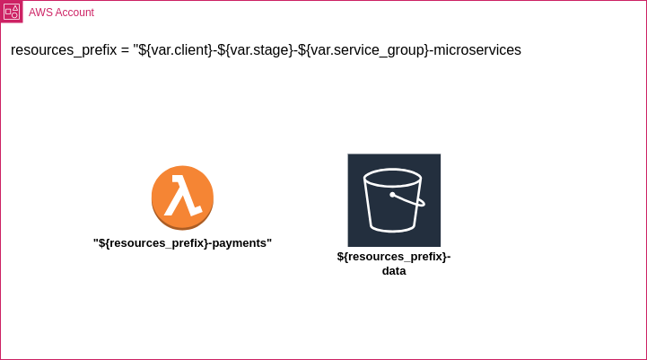

# tf-cicd-template



## repo structure

```markdown
├── configuration                           =>  workspaces configuration including all *.tfvars and *.backend.tfvars 
│   ├── acc
│   │   ├── arepabank.backend.tfvars
│   │   ├── arepabank.tfvars
│   │   └── ...
│   ├── dev
│   │   └── ...
│   ├── prd
│   │   └── ...
│   └── tst
│       └── ...
├── docs                                    
│   └── solution-schema.drawio.png          =>  solution schema editable in VS Code using 
│                                               the [extension](https://marketplace.visualstudio.com/items?itemName=hediet.vscode-drawio)
├── .github
│   ├── actions
│   │   ├── terraform-apply
│   │   └── terraform-plan
│   └── workflows                           =>  GH workflows. Name patterns
│       |                                       * `shared` => called by other workflow, more than one
│       ├── cd.yml                          =>  trigger when a PR is merged
│       ├── ci.yml                          =>  trigger when a PR is created or updated
│       ├── shared-get-changes.yml          =>  Detect changes in a PR
│       ├── shared-tf-apply.yml                 * `*.tf` changes trigger tf plan (ci.yml) or tf apply (cd.yml) on `dev` and `tst` workspaces
│       ├── shared-tf-apply.yml                 * `*.tfvars` changes  will trigger tf plan (ci.yml) or apply (cd.yml) on that workspace
│       └── shared-tfm-checks.yml           =>  terraform security checks
├── LICENSE
├── README.md
├── scripts                                 =>  scripts used by the GH workflows
│   └── shared-get-changes-functions.js     =>  pattern for naming the scripts: `{GH_WORKFLOW_CONSUMER}-functions.js`
|                                               example: `shared-get-changes.yml` -> `shared-get-changes-functions.js`
└── terraform                               =>  terraform files for ruling the infrastructure
    ├── backend.tf
    ├── data.tf
    ├── lambdas.role.tf
    ├── lambdas.tf
    ├── locals.tf
    ├── outputs.tf
    ├── providers.tf
    ├── s3.tf
    ├── src                                 =>  lambdas source code
    │   └── app.js
    ├── variables.metadata.tf               =>  metadata variables as `stage`, `client` or `aws_account_id`
    ├── variables.tf
    └── versions.tf
```

## CICD workflows

> 🚀 deployment are PR based, changes please check the next table 

| Change      | PR                                                | On merge to `main`                                  |
| ----------- | ------------------------------------------------- | --------------------------------------------------- |
| `*.tf*`     | plan the changes on `dev` and `tst`  workspace    | deploy changes merged to `dev` and `tst` workspaces |
| `*.tfvars*` | plan the current branch on the workspace modified | deploy the `main` branch on the workspace modified  |
